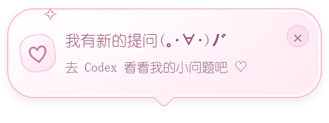

<div align="center">

# GPT_Dragon_girl_transformation

### 白发紫瞳的小龙娘，在桌边陪你认真工作 ♡

**v1.0.0 · Windows x64 · Live2D · Codex 全局任务监听 · 无配音**


[下载版本](https://github.com/ycwycw2020/GPT_Dragon_girl_transformation/releases) · [安装说明](docs/installation.md) · [操作指南](#操作指南) · [互动与成长](#互动与成长) · [v1.0 更新](docs/release-v1.0.md)

</div>

---

## 她会做些什么？

这是一个独立的桌面工作伴侣项目。角色保留银白偏淡紫长发、紫瞳、白色节纹龙角、尖耳和 ChatGPT 结形头饰，在白紫色的小工作桌前呼吸、眨眼、摇尾巴；工作时轻敲键盘、移动鼠标，空闲时按额度切换精力状态。

她也会跟随 Codex 的任务，在电脑上方用小小的粉白思考泡告诉你正在做什么。需要你回答问题，或者有新的进度与回复时，可以点击提示返回对应聊天。

| 小功能 | 当前支持 |
| --- | --- |
| Live2D 工作形态 | 真实 Cubism `.moc3` 模型，配合呼吸、眨眼、发丝与呆毛、尾巴、鼠标和键盘动作 |
| 精力与休息 | 工作、精力满满、略有疲惫、非常疲惫四种形态，以及无倒计时的闭眼休息 |
| 全局任务监听 | 从本机 Codex 用户数据发现不同目录的未归档主聊天，以会话身份区分任务；可自动跟随或固定选择 |
| 粉白思考泡 | 只显示当前操作或简短进度分类；点击先碎成小云片，再返回对应聊天 |
| 可爱互动 | 六个角色部位共 90 种分档动作，还有水杯、植物、小摆件、键盘、笔记本、鼠标与耳饰互动 |
| 慢慢成长 | Lv.1–100，好感与经验本地保存；满级显示 MAX |
| 桌面小窗口 | 自由拖动、缩放、自动镜像、置顶、鼠标穿透、虚拟桌面跟随；隐藏任务栏按钮，保留托盘入口 |
| Codex 入口 | 点击任务或提问提醒跳转；右键可在当前跟随目录新建聊天 |

**当前版本没有配音、语音播放或语音菜单。** 互动通过动作、表情和文字呈现。

## 快速开始

1. 在 [Releases](https://github.com/ycwycw2020/GPT_Dragon_girl_transformation/releases) 下载 **`GPT_Dragon_girl_transformation-v1.0.0.zip`**。
2. 将压缩包完整解压到可写目录，例如 `D:\Apps\GPT_Dragon_girl_transformation`。
3. 双击包根目录的 **`start.cmd`**。
4. 在桌面或系统托盘找到她；右键可调整大小、监听任务和角色状态。

默认窗口为 **180 × 200 逻辑像素**，即初始设计尺寸的 1/3。便携包附带 Electron 和 Cubism Web 运行组件，基础运行不需要另装 Node.js、Python、npm 或 Cubism Editor。

> 请先解压，再启动；不要只复制 EXE。模型和贴图需要保留包内目录结构。

想继续修改模型或程序，可下载 **`GPT_Dragon_girl_transformation-project-v1.0.0.zip`**：它包含运行组件、源码、测试与构建文件，以及整理后的角色原图、分层素材和 Cubism 工程。GitHub 的 **Download ZIP** 是仓库源码下载，不等于完整运行包。两个发布包均可使用随 Release 提供的 **`SHA256SUMS.txt`** 校验。

完整步骤、旧版本升级和随 Codex 启动设置见 [安装说明](docs/installation.md)。

## 操作指南

| 想做什么 | 操作 |
| --- | --- |
| 移动 | 按住角色、桌面主体或任务气泡拖动；拖动不会误触摸摸 |
| 缩放 | 指针放在角色上，按住 `Ctrl` 滚动；也可右键 → 缩放 |
| 键盘缩放 | 角色窗口获得焦点后，`Ctrl` + `+` / `-`；`Ctrl` + `0` 恢复默认 |
| 切换监听 | 右键角色、任务气泡或托盘 → **切换监听任务** |
| 回到对应聊天 | 点击任务云朵，先播放破碎再跳转；提问提醒也可直接点击，聚焦提示后可按 Enter / 空格 |
| 新建聊天 | 右键 → **在 Codex 新建聊天**；打开输入界面，不自动发送 |
| 收起云朵 | 悬停气泡后点击 `−`；右键 → **显示任务气泡** 可恢复 |
| 点碎已结束的云朵 | 任务结束后点击云朵小 `×`；新任务、新进度或新回复会让它再出现 |
| 查看好感 | 右键查看好感等级与本级进度 |
| 休息 / 唤醒 | 右键 → **休息** / **回到工作状态** |
| 恢复显示与交互 | 双击托盘图标，或按 `Ctrl` + `Alt` + `Shift` + `D` |
| 暂停动作 / 退出 | 角色或托盘右键菜单 |

缩放支持原始尺寸的 **25%–150%**，并适配屏幕可用区域。拖到当前显示器右半边时自动镜像，回到左半边恢复；**气泡随画面翻转，文字保持正常方向**。窗口位置、缩放、气泡显示和监听选择会自动保存。

窗口默认尝试固定到所有 Windows 虚拟桌面。置顶时会为输入法候选框和系统托盘弹出面板让位；虚拟桌面和置顶行为仍受 Windows Shell 与系统版本影响。更多细节见 [窗口与气泡说明](docs/window-presentation.md)。

## Codex 全局任务监听

**v1.0 按聊天身份监听，不再以桌宠所在项目目录作为发现范围。** 同一个目录中的不同聊天分别列出，项目位于其他日期目录或磁盘也可以被发现。

- **自动跟随任务：** 优先跟随活动会话；多个任务并行时，结束一个不会把其他任务一并判为结束。
- **固定监听：** 从菜单选择一个聊天，工作状态、任务气泡、提问提醒和点击跳转同步切换。选择会保存，任务结束后不会自动跳到别的聊天。
- **菜单名称：** 优先使用 Codex 的聊天名称，辅以短编号和状态；没有名称时才显示项目目录名。
- **发现范围：** 同一个本机 Codex 用户数据目录内，最近最多 **200 个未归档主聊天**。内部子代理不会各自冒充一个项目；未写入本地数据或无法访问的远端任务不能保证识别。

程序约每 **2 秒**只读刷新本地聊天索引和轮次生命周期，再通过有界日志检查补充当前操作；既有 Hooks 补充工具事件、提问提醒和回复提示。设置变更、额度更新和单纯文件时间变化不会被当成新任务，旧轮次的结束也不会覆盖新轮次。

默认读取当前用户的 `.codex` 数据目录；设置了 **`CODEX_HOME`** 时使用对应目录。桌宠与 Codex 应使用相同的用户和数据目录，详见 [接入与排查](docs/installation.md#codex-接入与排查)。

### 小小的思考泡与提问提醒

任务云朵锚定在画面中的电脑上方，只留一句“执行命令”“修改文件”“正在思考”，或“进度 · 测试进展”等简短分类，**不塞入目录和好感度**。点击主体，先播放约 **0.56 秒**的云片破碎动画，再回到被点击提示对应的聊天；拖动不触发跳转。

从点击起约 **6.5 秒**后，同一监听任务仍在运行且状态有效时，思考泡会重新出现；已结束或状态失效的提示继续收起。切换监听任务，或右键选择 **显示任务气泡**，可立即恢复；跳转失败时会还原提示。任务结束后的小 `×` 仍可只点碎云朵，不打开聊天。

<div align="center">

</div>

捕获到支持的提问事件时，出现 **“我有新的提问(｡･∀･)ﾉﾞ”**。点击主体回到提问所在的 Codex 聊天，点击提醒自己的 `×` 则关闭提示。提醒不抢输入焦点，关闭过的同一条不会反复弹出，最长显示 5 分钟。

提问识别依赖可用且受信任的 Hooks；普通问句和部分客户端的权限请求不一定能捕获。**回答、追加要求和权限审核都在 Codex 原界面完成**，桌宠不会代答、自动发送或批准请求。

### 精力状态

| 条件 | 表现 |
| --- | --- |
| 当前监听任务正在运行 | 工作 · 思考，认真又有一点迷糊 |
| 空闲，剩余额度 > 50% | 精力满满 |
| 空闲，15% ≤ 剩余额度 ≤ 50% | 略有疲惫 |
| 空闲，剩余额度 < 15% | 非常疲惫 |
| 额度不可用或过期 | 显示未知，不把未知当成用完 |

额度由已登录、可用的 Codex CLI 调用只读账户接口获取，约每 **120 秒**刷新。它与任务监听分别连接：能看见任务，不代表额度一定可用。右键 **角色状态** 可预览四种形态，或恢复 **跟随任务与额度**。

## 互动与成长

轻点**头顶、龙角、脸颊、小手、脚尖或尾巴**，她会按照好感阶段作出不同反应。六个部位，每档五种、共三档，总计 **90 种角色互动**；水杯、植物、小摆件与键盘，以及工作形态中的笔记本、鼠标、耳饰，另有各自的小动作。

| 阶段 | 反应与解锁 |
| --- | --- |
| Lv.1–3 · 慢慢熟悉 | 拘谨回应、小幅躲闪；脚尖与尾巴会小小抗议 |
| Lv.4–6 · 娇羞 | 脸红、低头、卷尾与悄悄偷看 |
| Lv.7–100 · 亲近与俏皮 | 点头、开心回应、轻轻贴近；Lv.10 时全部 90 种解锁 |
| Lv.100 · MAX | 成长条锁定满级，已解锁互动继续保留 |

每次满足奖励条件的互动获得 **2 点经验**，奖励间隔至少 **10 秒**，每日最多 **30 点**。前期升级需求从 6 点逐步增加，后期每级固定 24 点；播放了动作不一定代表本次还能获得经验。早安、午安和晚安问候按本地时间出现。

[可以摸哪里](docs/touch-guide.md) · [完整动作与解锁表](docs/affection-reactions.md)

### 让她安心休息 ☾

选择 **休息** 后切换为闭眼睡姿，没有倒计时，重启仍保留休息状态。手动选择 **回到工作状态**，或检测到休息之后明确开始的新任务时唤醒；旧任务继续调用工具不会单独把她叫醒。休息期间点击不奖励经验，也不会启动日常互动或自动问候。

**休息目前只控制桌宠，不能停止 Codex 正在运行的任务。** 需要停止项目时，请在 Codex 中操作。详见 [休息与控制范围](docs/codex-rest-control.md)。

## 模型与项目结构

当前有 **一个独立导出的 Cubism 工作模型**，三个空闲形态由本程序对确认原画做分区变形。双眼眨眼、修边、腿部与触摸增强也包含运行时实现；它们尚未全部回写到 Cubism 工程，单独把 `.moc3` 放入其他播放器不会获得全部效果。两个疲惫形态仍保留原有半闭眼神，尚无独立眼睑闭合动画。

```text
GPT_Dragon_girl_transformation/
├─ README.md
├─ docs/                            安装、互动和窗口说明、配图
├─ outputs/
│  ├─ dragon-companion-app-v4/       透明窗口、菜单、成长与启动逻辑
│  ├─ dragon-codex-bridge-v4/        全局聊天发现、生命周期、Hooks 与额度
│  ├─ live2d-preview-v4/             Cubism Web 渲染、互动和气泡
│  ├─ live2d-model-v4/               工作模型与 Cubism 工程
│  └─ live2d-runtime-v3/             状态与动作驱动
└─ work/                            本机运行数据；不作为公开仓库内容
```

技术组成：**Electron + JavaScript / ESM + Live2D Cubism SDK for Web**。设置与养成使用本地 JSON；Hook 写入使用本地 SQLite 锁。本程序是独立桌宠，运行包不会自动替换 Codex 原生宠物。

开发检查需要 Node.js 24 或更高版本；完整工程包还包含测试与发布构建文件。组件边界、版本变化见 [v1.0 说明](docs/release-v1.0.md)。

## 本地数据与常见问题

程序只读访问 Codex 索引和轮次记录；任务操作按事件类型、工具名称和时间判断，**不对内部思考正文、工具参数或命令内容作摘要**。公共助手输出只转换为固定进度分类，缓存分类、散列标识与时间，不另存整段消息。提问提醒不保存题目正文、选项或答案。

本机设置和成长数据位于 `work/desktop-app-v4/`，桥接缓存位于 `work/codex-bridge-v4/`。公开发布不应包含个人运行缓存、聊天记录、凭证或 Hooks 信任记录。移动安装目录后，原有 Hooks 和随启动快捷方式需要重新核对；信任不会随压缩包自动迁移。

<details>
<summary><strong>菜单里还是找不到某个项目？</strong></summary>

确认 Codex 与桌宠使用相同的用户和 `CODEX_HOME`，该聊天没有归档，且已写入本机索引。查看菜单上方是否显示“Codex全局任务已接入”。数据库不可用或格式变化时，会降级使用可用的 Hooks；不会仅凭目录或更新时间猜测任务在运行。关闭并重新启动桌宠后再检查，详细步骤见 [安装说明](docs/installation.md)。

</details>

<details>
<summary><strong>有任务，为什么没有提问提示或额度？</strong></summary>

全局任务发现、提问 Hooks 和额度接口是不同来源。提问需要 Hooks 正常运行并被信任，且工具事件受到支持；额度需要可用且已登录的 CLI。没有额度不等于额度归零，提示出现也不保证问题此刻仍未回答。

</details>

<details>
<summary><strong>桌宠不见了，或者无法点击？</strong></summary>

在系统托盘的隐藏图标里双击桌宠图标，或按 `Ctrl` + `Alt` + `Shift` + `D` 恢复交互。随后通过右键菜单重置位置和默认缩放；鼠标穿透开启时请先从托盘关闭。

</details>

<details>
<summary><strong>提示字体为什么和截图略有不同？</strong></summary>

优先使用系统的幼圆字体，缺失时采用后备字体。系统缩放和颜文字字形也会影响观感；项目不附带系统字体文件。

</details>

## 素材与授权

角色素材包含 AI 辅助制作，模型经过分层、绑定与 Cubism 导出。README 主视觉是角色素材预览，提问配图来自本地程序渲染。

本项目不是 OpenAI 或 Live2D 官方产品。自有代码与美术尚未指定统一开源许可证，公开展示不代表无限制商用、再分发或再授权许可。第三方组件的原有许可证与声明随目录保留：

- [Cubism 组件许可证](outputs/live2d-preview-v4/vendor/LICENSE.md)
- [Cubism Framework 许可证](outputs/live2d-preview-v4/vendor/Framework-LICENSE.md)
- [Cubism Core 许可证](outputs/live2d-preview-v4/vendor/Core/LICENSE.md)
- [Cubism 声明](outputs/live2d-preview-v4/vendor/NOTICE.md)
- Electron 运行包中的 `LICENSE` 与 `LICENSES.chromium.html`

---

<div align="center">

**认真工作，也记得休息。**<br>
她会在桌边，陪你把下一件小事做好 ♡

</div>
